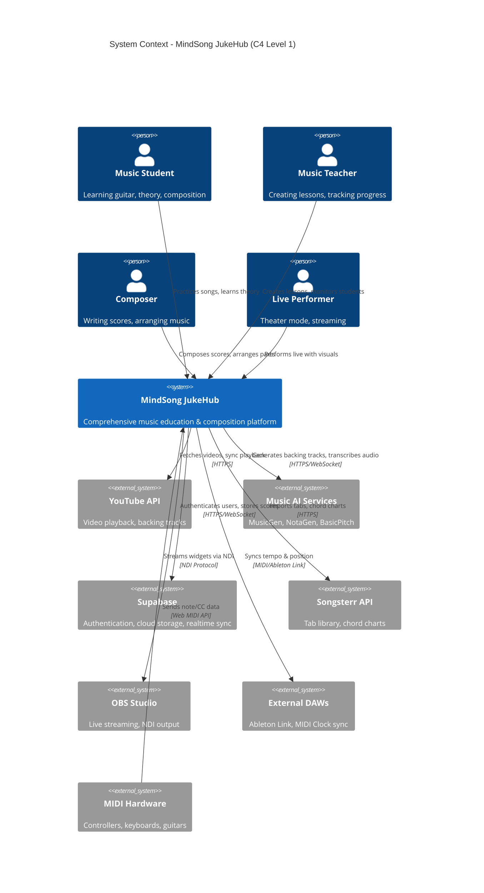
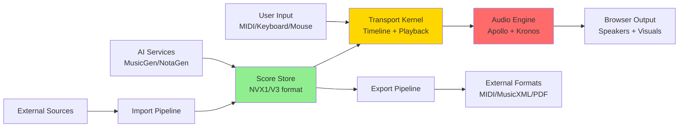
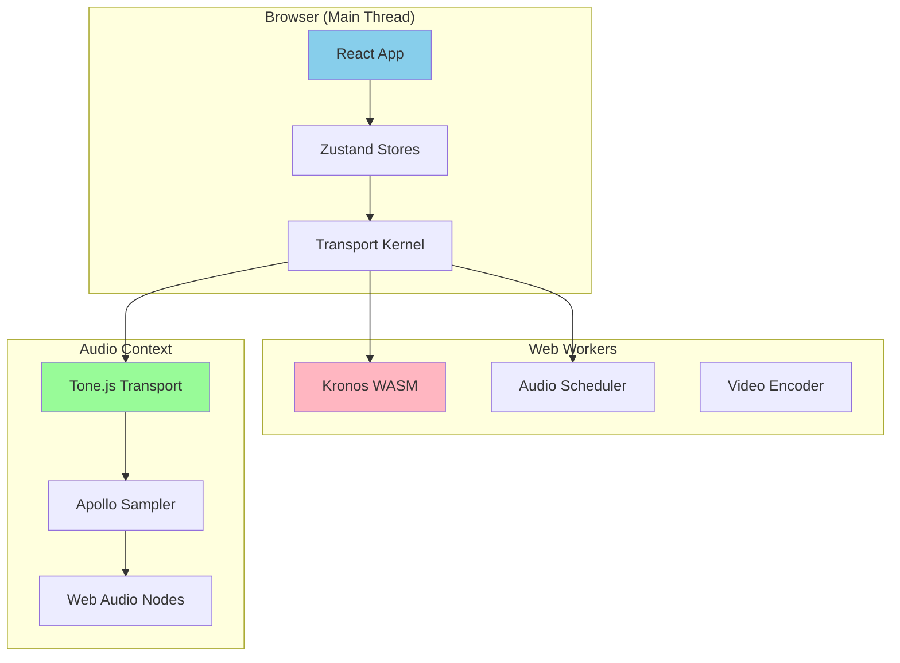

# 01 - System Context Diagram (C4 Level 1)

**Audience:** Executives, product managers, new engineers  
**Purpose:** Understand what MindSong JukeHub does and how it fits in the world

---

## System Context Overview

---

## External Actors

### 👤 Primary Users

| Actor | Use Cases | Key Features |
|-------|-----------|--------------|
| **Music Student** | Learn songs, practice theory, track progress | Interactive fretboard, chord progressions, adaptive lessons |
| **Music Teacher** | Create curricula, assign exercises, monitor students | Lesson builder, progress tracking, performance analytics |
| **Composer** | Write original music, arrange orchestrations | Score editor (NVX1), notation export, MIDI input |
| **Live Performer** | Theater mode for concerts, streaming overlays | 8K Theater, Quantum timeline, OBS integration |

### 🔌 External Systems

| System | Purpose | Integration Type | Critical? |
|--------|---------|------------------|-----------|
| **YouTube API** | Backing track playback, sync with score | REST API + iframe embed | 🟡 Medium |
| **Music AI (HuggingFace)** | MusicGen (audio gen), NotaGen (chord gen), BasicPitch (transcription) | HTTPS/WebSocket | 🟢 Optional |
| **Supabase** | User auth, cloud storage, realtime collab | PostgreSQL + Realtime channels | 🔴 Critical |
| **Songsterr** | Import existing tabs/chords | REST API | 🟢 Optional |
| **OBS Studio** | Stream widgets as NDI sources | NDI Protocol (local network) | 🟢 Optional |
| **External DAWs** | Tempo/position sync for hybrid workflows | Ableton Link, MIDI Clock | 🟢 Optional |
| **MIDI Hardware** | Live input from controllers/guitars | Web MIDI API (browser) | 🟡 Medium |

---

## System Boundaries

### What MindSong JukeHub **IS**

✅ **Score-centric music learning platform**  
✅ **Interactive guitar/piano fretboard visualizer**  
✅ **Real-time chord progression analyzer**  
✅ **Multi-format score editor (NVX1, MusicXML, Guitar Pro)**  
✅ **Theater-mode visualization engine (8K, Quantum, Myst)**  
✅ **AI-assisted composition tools**  
✅ **Multi-tenant education system** (teachers + students)

### What MindSong JukeHub **IS NOT**

❌ **DAW replacement** (no multi-track audio recording/editing)  
❌ **Social network** (limited community features)  
❌ **Streaming service** (no music library/licensing)  
❌ **Notation software competitor** (not MuseScore/Sibelius-level engraving)

---

## Core Value Propositions

### For Students
- **Visual Learning:** See chord progressions, scales, fretboard positions in real-time
- **Adaptive Curriculum:** AI-powered lesson progression based on performance
- **Multi-Modal Practice:** Audio, MIDI, video, notation all synchronized

### For Teachers
- **Lesson Authoring:** Create custom exercises with embedded theory
- **Progress Tracking:** Dashboard showing student practice time, accuracy, mastery
- **Content Library:** Share/reuse lessons across classes

### For Composers
- **Rapid Prototyping:** AI-generated chord suggestions, voice leading analysis
- **Multi-Format Export:** MusicXML, MIDI, PDF, Data3/Data4
- **Live Playback:** Hear scores with Apollo.js sample engine

### For Performers
- **Theater Mode:** Full-screen synchronized visuals for concerts
- **OBS Integration:** Individual widgets as NDI sources for streaming
- **MIDI Sync:** Lock to external hardware/DAWs for hybrid performances

---

## High-Level Data Flow

**Key Insight:** Everything flows through the **Score Store** (single source of truth) and the **Transport Kernel** (timeline authority).

---

## Technology Stack (Summary)

| Layer | Technologies |
|-------|-------------|
| **Frontend** | React 18 + TypeScript, Zustand (state), TanStack Query |
| **Audio** | Tone.js, Apollo.js (custom sampler), Web Audio API |
| **Timeline** | Kronos (Rust WASM), Quantum (RAF-based), UnifiedKernelEngine |
| **Backend** | Supabase (PostgreSQL + Edge Functions) |
| **AI/ML** | HuggingFace Inference API, TensorFlow.js (pitch detection) |
| **Build** | Vite, Biome (linting), Capacitor (mobile) |

---

## Deployment Model

**Critical Detail:** Audio worklets run in separate thread to avoid main-thread jank.

---

## Security & Privacy

| Aspect | Implementation |
|--------|----------------|
| **Authentication** | Supabase Auth (OAuth + email/password) |
| **Authorization** | Row-Level Security (RLS) in PostgreSQL |
| **Data Storage** | User scores encrypted at rest in Supabase |
| **API Keys** | Environment variables, never client-side |
| **MIDI/Audio** | Local-only (no server transmission) |

---

## Scalability Considerations

| Component | Current Limits | Scaling Strategy |
|-----------|---------------|------------------|
| **Concurrent Users** | ~1000 (Supabase free tier) | Migrate to Pro/Enterprise tier |
| **Score Complexity** | ~500 measures/score | Virtualized rendering, lazy loading |
| **Audio Samples** | ~100MB Apollo.js | CDN caching, progressive loading |
| **Real-time Sync** | ~10 users/session | Supabase Realtime channels |

---

## Next Steps

👉 **For deeper technical detail, continue to:**
- [02-CONTAINER-ARCHITECTURE.md](./02-CONTAINER-ARCHITECTURE.md) - See how components communicate
- [03-TRANSPORT-TIMELINE-ARCHITECTURE.md](./03-TRANSPORT-TIMELINE-ARCHITECTURE.md) - Understand the timeline mess
- [03c-SERVICE-INVENTORY.md](./03c-SERVICE-INVENTORY.md) - Browse all 300+ services

---

**Document Status:** ✅ Complete  
**Last Reviewed:** November 13, 2025  
**Maintained By:** Lead Architect
