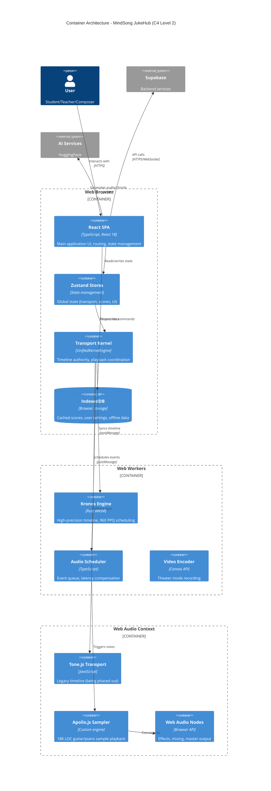
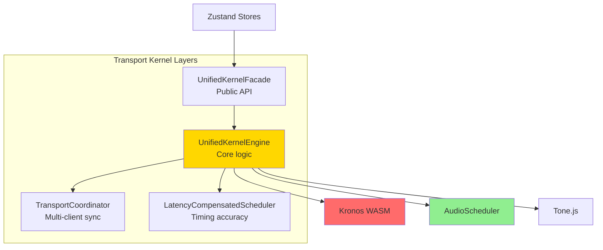
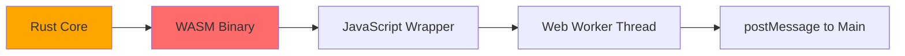
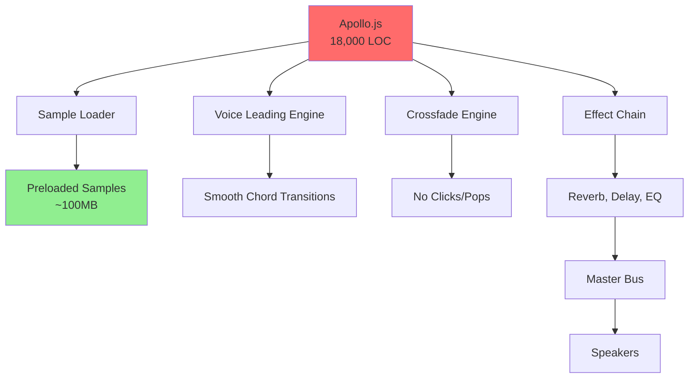
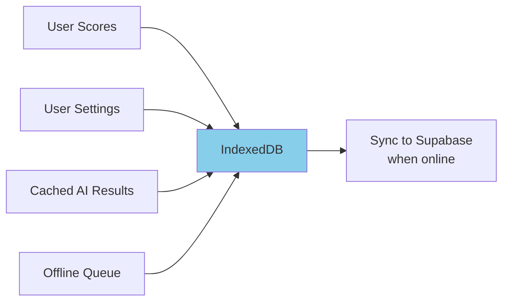
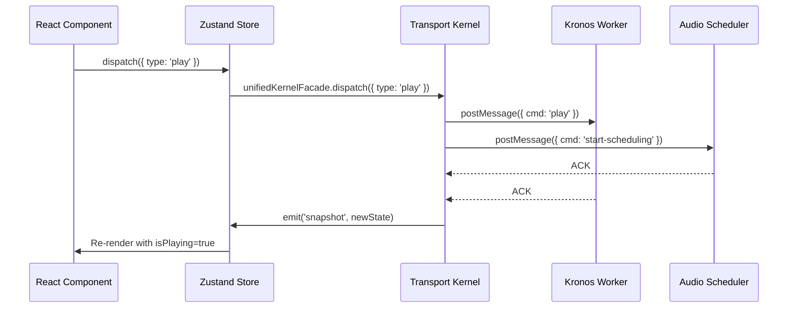
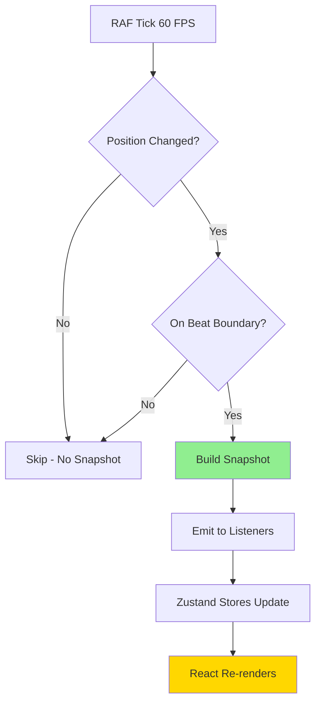
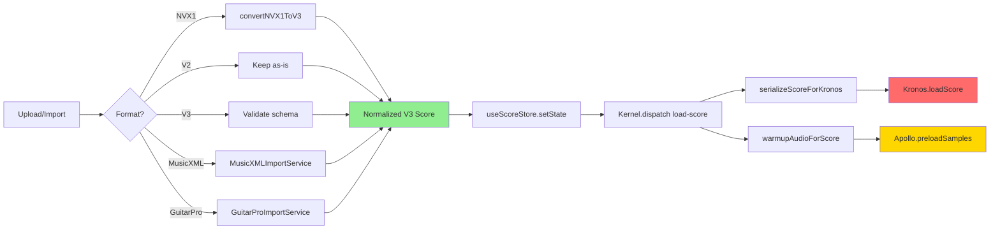
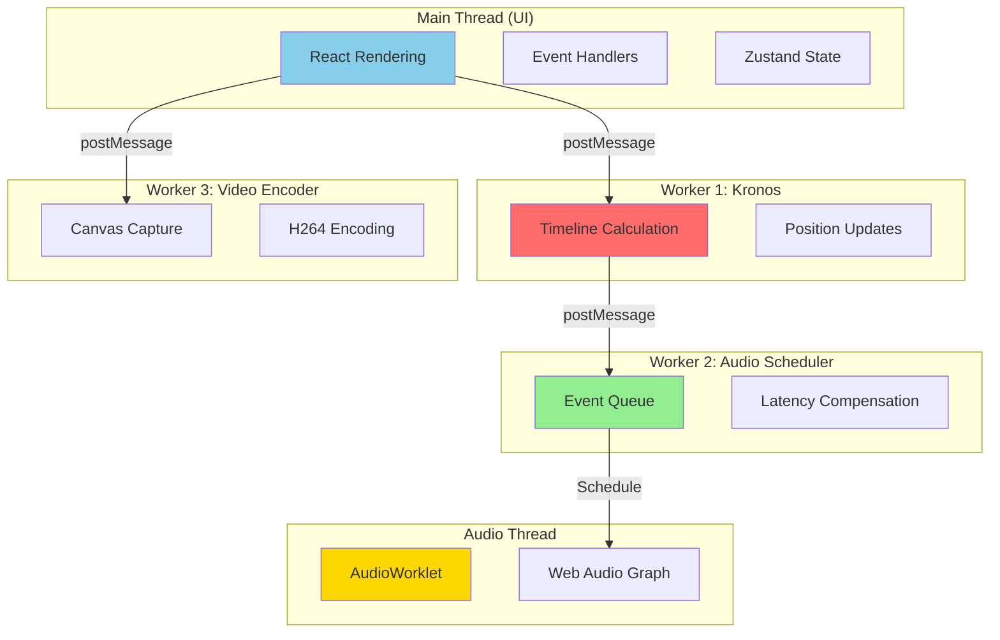
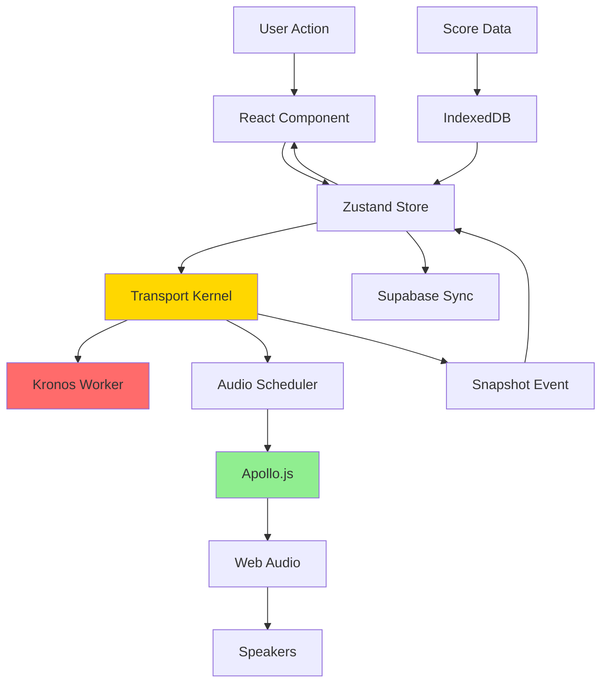

# 02 - Container Architecture Diagram (C4 Level 2)

**Audience:** Senior engineers, solution architects  
**Purpose:** Understand major technical components and communication patterns

---

## Container Overview

MindSong JukeHub is a **browser-based single-page application** with the following high-level containers:



---

## Container Inventory

### 1️⃣ **React SPA** (Main Thread)

| Aspect | Details |
|--------|---------|
| **Technology** | React 18, TypeScript, Vite |
| **Size** | ~2MB bundle (minified + gzipped) |
| **Responsibilities** | - UI rendering (20+ pages)<br>- User input handling<br>- Routing (`/nvx1-score`, `/theater`, `/olympus`, etc.)<br>- Component lifecycle |
| **Key Pages** | `NVX1Score.tsx`, `Theater.tsx`, `Olympus.tsx`, `MSM.tsx`, `Quantum.tsx`, `MIDI-test.tsx` |
| **State Management** | Zustand stores (15+ stores) |
| **Deployment** | CDN (Vercel/Netlify), served as static files |

**Critical Insight:** Main thread is **UI-only**. All heavy computation moved to workers.

---

### 2️⃣ **Zustand Stores** (State Layer)

| Store | Purpose | Size | Critical? |
|-------|---------|------|-----------|
| `useTransportStore` | Playback state (play/pause/seek) | 500 LOC | 🔴 Critical |
| `useNVX1Store` | Score data (parts, measures, notes) | 800 LOC | 🔴 Critical |
| `useQuantumStore` | Quantum timeline state | 400 LOC | 🟡 Medium |
| `useOlympusStore` | Olympus page config | 300 LOC | 🟢 Optional |
| `useScoreStore` | V3 score format | 600 LOC | 🔴 Critical |
| `useToussaintMetronomeStore` | Metronome settings | 200 LOC | 🟢 Optional |
| ... | *10+ more stores* | ... | ... |

**Architecture Pattern:** Stores subscribe to **Transport Kernel** via `useSyncExternalStore` for reactivity.

```typescript
// Example: How stores sync with kernel
const snapshot = useSyncExternalStore(
  unifiedKernelFacade.subscribe('snapshot'),
  unifiedKernelFacade.getSnapshot
);
```

---

### 3️⃣ **Transport Kernel** (Timeline Authority)



**Responsibilities:**
- ✅ Single source of truth for playback state
- ✅ Coordinate Quantum (visual) vs Kronos (audio) timelines
- ✅ Handle play/pause/seek/loop commands
- ✅ Emit snapshots on beat boundaries (not 60 FPS)
- ✅ Load scores, calculate measure timing

**API:**
```typescript
// Dispatch commands
unifiedKernelFacade.dispatch({ type: 'play' });
unifiedKernelFacade.dispatch({ type: 'load-score', payload: nvx1Score });
unifiedKernelFacade.dispatch({ type: 'seek', position: { measureIndex: 4, beatInMeasure: 2 } });

// Subscribe to events
unifiedKernelFacade.subscribe('snapshot', (event) => {
  console.log('New snapshot:', event.snapshot);
});
```

---

### 4️⃣ **Kronos Engine** (Web Worker - WASM)



| Aspect | Details |
|--------|---------|
| **Language** | Rust → compiled to WASM |
| **Size** | ~500KB WASM module |
| **Precision** | 960 PPQ (pulses per quarter note) |
| **Features** | - High-precision timeline<br>- Tempo map support<br>- Loop handling<br>- Event scheduling |
| **Thread** | Runs in dedicated Web Worker (no main thread blocking) |
| **Communication** | `postMessage` for commands, structured clone for data |

**Why Rust?** Sample-accurate timing requires deterministic performance (no GC pauses).

**API:**
```typescript
kronosEngine.loadScore(serializedScore); // Load score events
kronosEngine.play(); // Start playback
kronosEngine.seek(measure, beat); // Jump to position
kronosEngine.getState(timestamp); // Get current position
```

---

### 5️⃣ **Audio Scheduler** (Web Worker - TypeScript)

| Aspect | Details |
|--------|---------|
| **Purpose** | Queue audio events ahead of playback time |
| **Lookahead** | 100ms (configurable) |
| **Jitter Tolerance** | <5ms (measured via diagnostics) |
| **Event Types** | Note on/off, chord changes, metronome clicks |
| **Targets** | Apollo.js (primary), Tone.js (fallback) |

**Flow:**
```
Kronos (timeline position) 
  → AudioScheduler (queue events @ currentTime + 100ms)
  → Apollo.js (trigger samples)
  → Web Audio (speakers)
```

**Latency Compensation:**
```typescript
const scheduleTime = audioContext.currentTime + lookAheadMs / 1000;
apolloInstance.playMelody([note], duration, velocity, scheduleTime);
```

---

### 6️⃣ **Apollo.js Sampler** (Web Audio API)



**Technology:** Custom JavaScript audio engine (predates Tone.js integration)

**Features:**
- ✅ Multi-sampled guitar/piano/bass
- ✅ Velocity layers (3-5 per note)
- ✅ Round-robin sample selection
- ✅ Voice leading for smooth chord progressions
- ✅ Built-in effects (reverb, delay, chorus)

**Loading Strategy:**
1. **On page load:** Preload C major scale (instant feedback)
2. **Lazy load:** Fetch other notes on-demand
3. **Cache:** Store in memory for session

**Critical Path:**
```typescript
// AudioScheduler calls this:
window.Apollo.get().playMelody([note], duration, velocity);

// Apollo internally:
// 1. Select appropriate sample (velocity + round-robin)
// 2. Schedule via Web Audio API
// 3. Apply crossfade if chord change
// 4. Route through effect chain
```

---

### 7️⃣ **Tone.js Transport** (Legacy - Being Phased Out)

| Aspect | Details |
|--------|---------|
| **Status** | 🟡 **Deprecated** (replaced by Kronos for new features) |
| **Current Use** | Fallback for MIDI-test page, legacy widgets |
| **Migration Plan** | Remove by Q2 2026 |
| **Why Deprecated?** | - Not sample-accurate<br>- BPM drift over long sessions<br>- Conflicts with Kronos timeline |

**Do NOT use for new features.** Use `unifiedKernelFacade` instead.

---

### 8️⃣ **IndexedDB** (Browser Storage)



**Stores:**
- `scores` - Full score JSON (NVX1, V2, V3 formats)
- `settings` - User preferences, UI state
- `cache` - AI-generated content (chord suggestions, backing tracks)
- `offline-queue` - Actions to sync when online

**Quota:** ~50MB typical, up to 1GB available (browser-dependent)

---

## Communication Patterns

### Pattern 1: Command → Kernel → Workers



**Key Insight:** Kernel orchestrates, workers execute in parallel.

---

### Pattern 2: Snapshot Propagation (Beat Boundaries Only)



**Before Fix:** 60 snapshots/sec → 240+ re-renders/sec  
**After Fix:** 2-4 snapshots/sec (only on beat changes) → 8-16 re-renders/sec

---

### Pattern 3: Score Loading Pipeline



**Critical:** All formats converge to **V3 schema** before playback.

---

## Threading Model



**Performance Impact:**
- **Main Thread:** ~10% CPU (UI only)
- **Kronos Worker:** ~5% CPU (timeline math)
- **Audio Scheduler:** ~15% CPU (event queue)
- **Audio Thread:** ~20% CPU (sample playback)

---

## Data Flow Summary



---

## Technology Decisions & Rationale

| Decision | Rationale |
|----------|-----------|
| **Rust WASM for Kronos** | Sample-accurate timing requires no GC pauses; Rust provides deterministic performance |
| **Web Workers for scheduling** | Offload heavy computation from main thread to avoid UI jank |
| **Apollo.js custom sampler** | Tone.js couldn't handle voice leading smoothly; needed full control |
| **Zustand over Redux** | Simpler API, better TypeScript support, no boilerplate |
| **Vite over Webpack** | 10x faster dev server, native ESM, better tree-shaking |
| **Supabase over Firebase** | PostgreSQL (relational), built-in auth, easier migrations |

---

## Known Limitations & Bottlenecks

| Issue | Impact | Workaround |
|-------|--------|------------|
| **300+ services** | Hard to navigate codebase | This documentation + consolidation plan |
| **5 timeline systems** | Timing conflicts, race conditions | Migrate all to UnifiedKernel |
| **Apollo.js size (100MB samples)** | Slow initial load | CDN + progressive loading |
| **No server-side audio** | Can't generate MP3 exports | Use WebCodecs API client-side |

---

## Next Steps

👉 **Dive deeper into specific subsystems:**
- [03-TRANSPORT-TIMELINE-ARCHITECTURE.md](./03-TRANSPORT-TIMELINE-ARCHITECTURE.md) - Timeline chaos explained
- [03a-AUDIO-PLAYBACK-ARCHITECTURE.md](./03a-AUDIO-PLAYBACK-ARCHITECTURE.md) - Apollo + Kronos detailed
- [03c-SERVICE-INVENTORY.md](./03c-SERVICE-INVENTORY.md) - Browse all services

---

**Document Status:** ✅ Complete  
**Last Reviewed:** November 13, 2025
