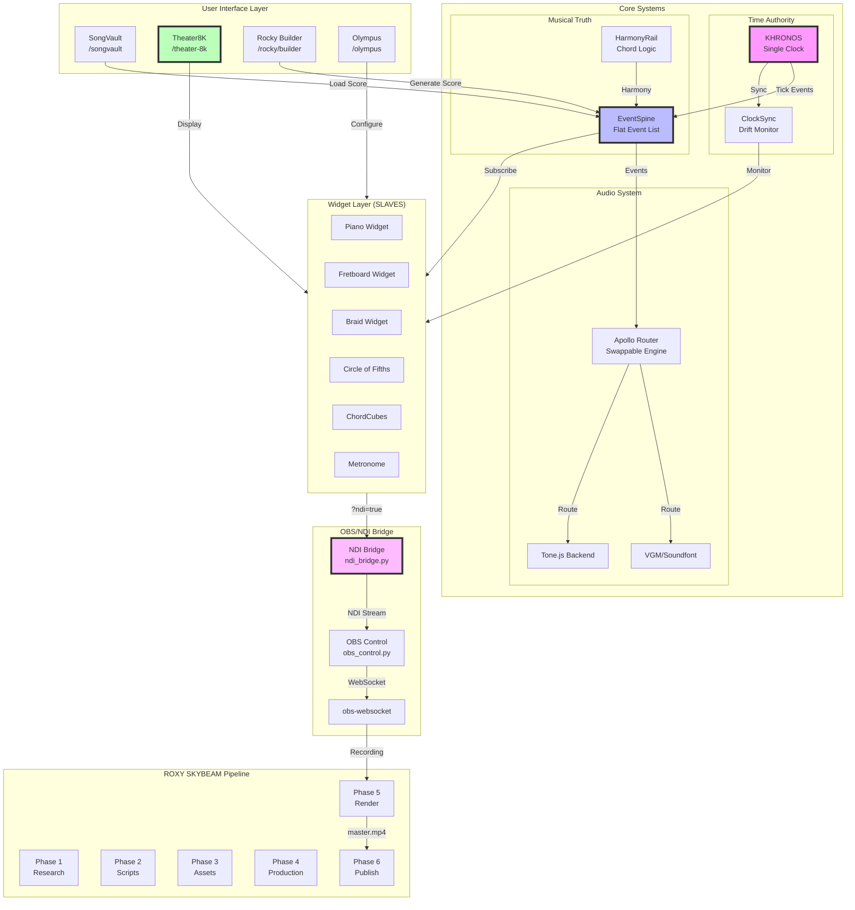
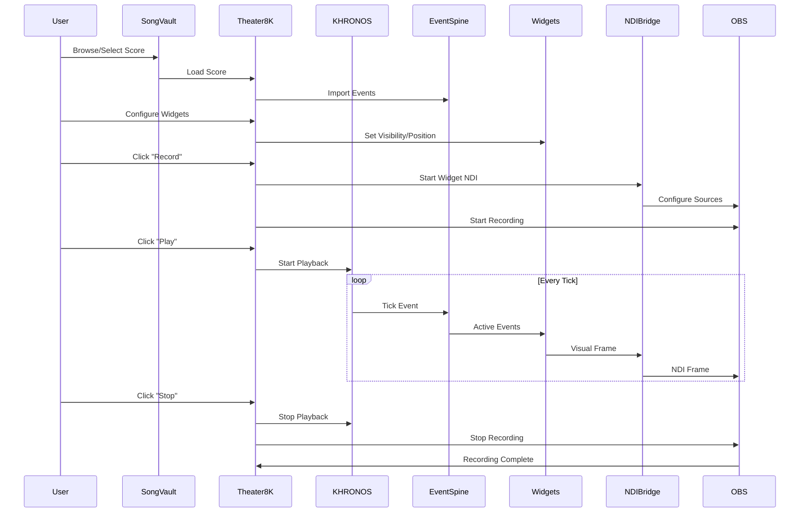

# SYSTEM INVENTORY + INTEGRATION PROPOSITION
## 8K Theater + Rocky + SongVault + OBS/NDI Integration

> **Version:** 1.0
> **Date:** 2026-01-11
> **Scope:** Complete system inventory with integration proposition for video content creation pipeline

---

# DELIVERABLE 1: EXECUTIVE OVERVIEW

## What We Have

### ROXY Infrastructure (Automated Content Factory)
- **22 systemd timers** running SKYBEAM 6-phase content pipeline
- **4 active services**: content-handler, panel-daemon, proxy, skybeam-worker
- **64 Python service modules** for research, scripting, production, publishing
- **CLI tools**: `skybeam`, `roxy`, `validate_credentials`

### MindSong Juke Hub (Music Visualization Platform)
- **1,383 TSX components** across the application
- **75+ routes** including Theater8K, SongVault, Olympus, Rocky
- **KHRONOS time authority** - single source of musical time
- **EventSpine** - flat canonical event list, all widgets subscribe
- **Apollo Audio System** - swappable audio engine abstraction
- **Widget Architecture** - Piano, Fretboard, Braid, COF, ChordCubes as NDI-capable sources

### OBS/NDI Bridge (Existing)
- **`~/.roxy/mcp-servers/obs/ndi_bridge.py`** - widgets as NDI sources
- **`~/.roxy/mcp-servers/obs/obs_control.py`** - OBS scene/recording control
- **NDI Widget URLs**: `http://localhost:5173/widgets/{name}?ndi=true`

## What We Need

1. **Score Selection Flow**: SongVault -> Theater8K loader integration
2. **Widget Preset System**: Save/load widget visibility, positions, animations
3. **Recording Orchestration**: Coordinated play/record/stop across KHRONOS + OBS
4. **Rocky Integration**: "Instant Jam" score generation -> Theater8K playback

## Golden Path User Story

```
1. User opens SongVault, browses/uploads a score
2. User clicks "Open in 8K Theater" -> Score loads in Theater8K
3. User configures widget layout (Piano, Fretboard, Braid visibility/positions)
4. User saves preset as "My Jazz Layout"
5. User clicks "Record with OBS" -> OBS starts, widgets sync to NDI
6. User presses Play -> KHRONOS drives EventSpine -> all widgets animate
7. Recording completes -> video ready for SKYBEAM publish pipeline
```

---

# DELIVERABLE 2: FULL INVENTORY - ROXY

## Active Systemd Services (4)

| Service | Purpose | Port |
|---------|---------|------|
| `roxy-content-handler.service` | SKYBEAM content request handler | - |
| `roxy-panel-daemon.service` | Panel feed daemon | - |
| `roxy-proxy.service` | Token injection proxy | 9136 |
| `roxy-skybeam-worker.service` | P0 master.mp4 renderer | - |

## Active Systemd Timers (22)

| Timer | Service | Phase | Schedule |
|-------|---------|-------|----------|
| `roxy-trend-detector.timer` | STORY-006 | P1 | Every hour |
| `roxy-deep-research.timer` | STORY-007 | P1 | Every hour |
| `roxy-competitor-analyzer.timer` | STORY-008 | P2 | Every hour |
| `roxy-bundle-writer.timer` | STORY-009 | P2 | Every hour |
| `roxy-script-generator.timer` | STORY-010 | P3 | Every hour |
| `roxy-template-library.timer` | STORY-011 | P3 | Every hour |
| `roxy-script-reviewer.timer` | STORY-012 | P3 | Every hour |
| `roxy-asset-briefs.timer` | STORY-013 | P4 | Every hour |
| `roxy-prompt-packs.timer` | STORY-014 | P4 | Every hour |
| `roxy-storyboards.timer` | STORY-015 | P4 | Every hour |
| `roxy-asset-qa.timer` | STORY-016 | P4 | Every hour |
| `roxy-prod-render-requests.timer` | STORY-017 | P5 | Every hour |
| `roxy-prod-renderer.timer` | STORY-018 | P5 | Every hour |
| `roxy-prod-master.timer` | STORY-019 | P5 | Every hour |
| `roxy-prod-qa.timer` | STORY-020 | P5 | Every hour |
| `roxy-publish-queue.timer` | STORY-021 | P6 | Every hour |
| `roxy-publish-packager.timer` | STORY-022 | P6 | Every hour |
| `roxy-youtube-publisher.timer` | STORY-023 | P6 | Every hour |
| `roxy-tiktok-publisher.timer` | STORY-024 | P6 | Every hour |
| `roxy-publish-metrics.timer` | STORY-025 | P6 | Every hour |
| `roxy-publish-health.timer` | STORY-026 | P6 | Every hour |
| `roxy-seed-ingestor.timer` | STORY-031b | P1 | Every hour |

## Python Service Modules (64 files)

### Root Services (`~/.roxy/services/`)

| File | Purpose | Lines |
|------|---------|-------|
| `content_request_handler.py` | SKYBEAM content request handling | 11,785 |
| `obs_client.py` | OBS WebSocket client | 32,611 |
| `roxy_core.py` | Core ROXY orchestration | 15,694 |
| `jarvis_core.py` | AI assistant core | 15,742 |
| `roxy_interface_enhanced.py` | Enhanced ROXY interface | 23,486 |
| `ghost_publisher.py` | Ghost publishing | 12,152 |
| `validation_loop.py` | Validation loop | 11,303 |
| `streaming.py` | Streaming services | 9,421 |
| `repository_indexer.py` | Repository indexing | 13,304 |
| `skybeam_p0_renderer.py` | P0 master.mp4 renderer | 5,645 |
| `orchestrator.py` | Service orchestration | 5,301 |
| `quality_checker.py` | Quality checking | 5,587 |
| `error_handler.py` | Error handling | 4,936 |
| `repository_rag.py` | RAG over repository | 5,604 |
| `observability.py` | Observability/telemetry | 5,678 |
| `self_correction.py` | Self-correction loop | 5,439 |
| `skybeam_worker.py` | SKYBEAM worker | 1,188 |

### Phase 1 Services (`~/.roxy/services/phase1/`)

| File | Purpose |
|------|---------|
| `trend_detector.py` | Trend detection (STORY-006) |
| `deep_research_agent.py` | Deep research (STORY-007) |
| `seed_ingestor.py` | Manual seed ingestion (STORY-031b) |

### Research Services (`~/.roxy/services/research/`)

| File | Purpose |
|------|---------|
| `competitor_analyzer.py` | Competitor analysis (STORY-008) |
| `research_index_builder.py` | Research index building |
| `trending_topics_analyzer.py` | Trending topics analysis |

### Scripting Services (`~/.roxy/services/scripting/`)

| File | Purpose |
|------|---------|
| `bundle_writer.py` | Bundle writing (STORY-009) |
| `script_generator.py` | Script generation (STORY-010) |
| `template_library_builder.py` | Template library (STORY-011) |
| `script_reviewer.py` | Script review (STORY-012) |

### Assets Services (`~/.roxy/services/assets/`)

| File | Purpose |
|------|---------|
| `asset_brief_builder.py` | Asset briefs (STORY-013) |
| `prompt_pack_generator.py` | Prompt packs (STORY-014) |
| `storyboard_generator.py` | Storyboards (STORY-015) |
| `asset_qa_gate.py` | Asset QA (STORY-016) |

### Production Services (`~/.roxy/services/production/`)

| File | Purpose |
|------|---------|
| `render_request_builder.py` | Render requests (STORY-017) |
| `renderer_runner.py` | Renderer execution (STORY-018) |
| `master_assembler.py` | Master assembly (STORY-019) |
| `production_qa_gate.py` | Production QA (STORY-020) |

### Publish Services (`~/.roxy/services/publish/`)

| File | Purpose |
|------|---------|
| `queue_builder.py` | Queue building (STORY-021) |
| `packager.py` | Package preparation (STORY-022) |
| `youtube_publisher.py` | YouTube Shorts publishing (STORY-023) |
| `tiktok_publisher.py` | TikTok publishing (STORY-024) |
| `metrics_collector.py` | Metrics collection (STORY-025) |
| `health_gate.py` | Publish health (STORY-026) |

## CLI Tools (`~/.roxy/bin/`)

| Tool | Purpose | Lines |
|------|---------|-------|
| `skybeam` | SKYBEAM CLI (status, inject, drain, ack) | 23,038 |
| `roxy` | ROXY CLI | 3,045 |
| `validate_credentials.py` | Credential validation | 11,113 |
| `selftest_skybeam.py` | SKYBEAM self-test | 9,215 |
| `selftest_skybeam_inject.py` | SKYBEAM inject self-test | 11,537 |
| `obs-clean` | OBS cleanup script | 545 |

## MCP Servers (`~/.roxy/mcp-servers/`)

| Server | Purpose | Key Files |
|--------|---------|-----------|
| `obs/` | OBS/NDI integration | `obs_control.py`, `ndi_bridge.py` |
| `browser/` | Browser automation | `server.py` |
| `desktop/` | Desktop control | `server.py` |
| `voice/` | Voice synthesis | `server.py` |
| `content/` | Content management | `server.py` |
| `teaching/` | Teaching features | `server.py` |

---

# DELIVERABLE 3: FULL INVENTORY - MindSong Juke Hub

## Application Statistics

| Metric | Count |
|--------|-------|
| TSX Components | 1,383 |
| Routes | 75+ |
| Widget Types | 15+ |
| Test Files | 533 |

## Major Routes (from App.tsx)

### Core Pages

| Route | Component | Purpose |
|-------|-----------|---------|
| `/` | `Index` | Landing page |
| `/dashboard` | `Dashboard` | User dashboard (protected) |
| `/auth` | `Auth` | Authentication |
| `/profile` | `Profile` | User profile (protected) |

### Music Visualization

| Route | Component | Purpose |
|-------|-----------|---------|
| `/theater-8k` | `Theater8K` | **8K Theater - WebGPU rendered theater** |
| `/nvx1-score` | `NVX1Score` | NVX1 score renderer |
| `/score` | `Score` | Score viewer |
| `/olympus` | `OlympusPage` | Widget convergence page |
| `/olympus/piano` | `OlympusPianoPage` | Piano widget page |
| `/olympus/fretboard` | `OlympusFretboardPage` | Fretboard widget page |
| `/olympus/circle` | `OlympusCirclePage` | Circle of Fifths page |
| `/olympus/braid` | `OlympusBraidPage` | Braid visualization page |
| `/olympus/score` | `OlympusScorePage` | Score widget page |
| `/braid` | `BraidTheater` | Braid theater (legacy) |
| `/theater` | `Theater` | Theater page (legacy) |
| `/myst-theater` | `MystTheater` | Myst theater (legacy) |
| `/novaxe-theater` | `NovaxeTheaterPage` | Novaxe theater (legacy) |

### Rocky & Score Building

| Route | Component | Purpose |
|-------|-----------|---------|
| `/rocky/builder` | `RockyScoreBuilder` | **Rocky Score Builder - Instant Jam** |
| `/rocky-brain` | `RockyBrain` | Rocky AI brain |
| `/rockytestgym` | `RockyTestGym` | Rocky testing |
| `/notagenpage` | `NotaGenPage` | NotaGen AI generation |

### SongVault & Content

| Route | Component | Purpose |
|-------|-----------|---------|
| `/songvault` | `SongVault` | **SongVault - Score library** |
| `/songs` | `SongExplorer` | Song explorer |
| `/guitartube` | `GuitarTube` | Guitar video content |
| `/livehub` | `LiveHub` | Live music hub |

### ChordCubes & Widgets

| Route | Component | Purpose |
|-------|-----------|---------|
| `/chordcubes` | `ChordCubes` | ChordCubes 3D visualization |
| `/chordcubes-v4-demo` | `ChordCubeV4Demo` | V4 demo |
| `/myst-cube-room` | `MystCubeRoom` | Myst cube room |
| `/chord-block-demo` | `ChordBlockDemo` | Chord block demo (dev) |

### Development & Testing

| Route | Component | Purpose |
|-------|-----------|---------|
| `/dev/ingest` | `DevIngest` | Dev ingest testing |
| `/dev/event-spine-trax` | `DevEventSpineTrax` | EventSpine testing |
| `/dev/audio-test` | `AudioFormatTest` | Audio format testing |
| `/apollo` | `ApolloTest` | Apollo audio testing |
| `/obs-websocket-test` | `OBSWebSocketTest` | OBS WebSocket testing |
| `/vision1-test` | `Vision1TestPage` | Vision testing |
| `/workshop/widgets` | `WidgetLabPage` | Widget lab |
| `/ghost-protocol` | `GhostProtocol` | Architecture map |

### Command Centers

| Route | Component | Purpose |
|-------|-----------|---------|
| `/command-center` | `CommandCenter` | Unified command center |
| `/roxy` | `RoxyPage` | ROXY AI command center |
| `/cockpit` | `MOSCockpitPage` | MOS cockpit (GPU) |

### Music Project

| Route | Component | Purpose |
|-------|-----------|---------|
| `/music_project` | `MusicProject` | Music project base |
| `/music_project/home` | `MPBrowse` | Project browser |
| `/music_project/tabview/:scoreId` | `MPTabView` | Tab view |

## Key Services & Systems

### Time Authority (KHRONOS)

| File | Purpose |
|------|---------|
| `src/providers/KhronosPositionProvider.tsx` | Position provider |
| `src/services/khronos/` | Khronos services |
| `src/hooks/useKhronosTick.ts` | Tick subscription hook |

### EventSpine (Musical Truth)

| File | Purpose |
|------|---------|
| `src/services/eventSpine/` | EventSpine core |
| `src/hooks/useEventSpine*.ts` | EventSpine subscription hooks |

### Apollo Audio

| File | Purpose |
|------|---------|
| `src/apollo/` | Apollo audio system (2.2MB) |
| `src/services/audio/` | Audio services |
| `src/audio/AudioEngine.ts` | Audio engine |

### SongVault

| File | Purpose |
|------|---------|
| `src/pages/SongVault.tsx` | SongVault page |
| `src/services/SongVaultLoader.ts` | Score loading |
| `src/app/songvault/` | SongVault components |

### Theater8K

| File | Purpose |
|------|---------|
| `src/pages/Theater8K.tsx` | Theater8K page |
| `src/components/theater/` | Theater components |
| `src/components/theater/widgets/` | Theater widgets |

### Widget Registry

| File | Purpose |
|------|---------|
| `src/components/theater/widgets/v3/` | V3 widgets |
| `src/components/theater/widgets/golden/` | Golden widgets |
| `src/components/theater/widgets/msm/` | MSM widgets |
| `src/components/olympus/Registry/` | Widget registry |

## Registered Widget Types

### V3 Widgets (`register-v3-widgets.ts`)
- Piano, Fretboard, Braid, Circle of Fifths, Score

### Golden Widgets (`register-golden-widgets.ts`)
- Metronome, Transport, Playhead

### MSM Widgets (`register-msm-widgets.ts`)
- MSM Harmonic Chart, Harmonic Profile

### ChordCubes Widget (`register-chordcubes-widget.ts`)
- ChordCubes 3D visualization

### Placeholder Widgets (`register-placeholder-widgets.ts`)
- Placeholder widgets for development

---

# DELIVERABLE 4: SYSTEM MAP (Existing Architecture)



## Data Flow Diagram



---

# DELIVERABLE 5: INTEGRATION PROPOSITION

## Option A: Minimal Integration (Recommended First)

### Scope
Connect existing pieces with minimal new code. Focus on orchestration, not new features.

### Components to Wire

1. **SongVault -> Theater8K Loader**
   - Add "Open in 8K Theater" button to SongVault
   - Use existing `SongVaultLoader.ts` to load score
   - Navigate to `/theater-8k?scoreId={id}`
   - Theater8K reads scoreId from URL, loads via EventSpine

2. **Widget Preset System**
   - Store presets in localStorage or Supabase
   - Schema: `{ name, widgets: [{ id, visible, position, scale }] }`
   - Add preset selector dropdown to Theater8K toolbar
   - Presets are JSON, no new services needed

3. **Recording Button**
   - Add "Record with OBS" button to Theater8K
   - On click: Call `obs_control.py` via MCP to start recording
   - On stop: Call `obs_control.py` to stop recording
   - Use existing `ndi_bridge.py` for widget NDI

4. **Rocky -> Theater8K Flow**
   - Rocky Builder generates score JSON
   - Save to SongVault (already exists)
   - Button: "Preview in 8K Theater" -> same flow as #1

### Estimated Effort
- **SongVault button**: 2-4 hours
- **Preset system**: 4-8 hours
- **Recording button**: 4-8 hours
- **Rocky flow**: 2-4 hours
- **Total**: 12-24 hours of development

### Files to Modify

| File | Change |
|------|--------|
| `src/pages/SongVault.tsx` | Add "Open in Theater" button |
| `src/pages/Theater8K.tsx` | Add URL param loading, preset UI, record button |
| `src/components/rocky/RockyScoreBuilder.tsx` | Add "Preview in Theater" button |
| `~/.roxy/mcp-servers/obs/obs_control.py` | Verify start/stop recording MCP tools |

---

## Option B: Robust Integration (Full Featured)

### Scope
Full production pipeline with state management, error handling, and automation.

### Additional Components

1. **Theater Session Manager**
   - New service: `TheaterSessionManager.ts`
   - Manages: score loading, widget state, recording state
   - Persists session to Supabase for recovery
   - Provides hooks: `useTheaterSession()`

2. **Widget Animation Presets**
   - Beyond visibility: animation styles per widget
   - Schema: `{ widget, animation: 'pulse' | 'glow' | 'fade', trigger: 'beat' | 'chord' | 'note' }`
   - Tie to KHRONOS events for sync

3. **OBS Scene Builder**
   - Auto-generate OBS scenes from Theater8K layout
   - MCP tool: `obs_create_scene_from_theater(layout)`
   - Handle multiple camera angles / widget arrangements

4. **Recording Pipeline Integration**
   - After recording: auto-ingest to SKYBEAM Phase 5
   - Generate handoff.json with metadata
   - Queue for Phase 6 publishing

5. **Rocky Real-Time Preview**
   - As Rocky generates, stream events to Theater8K
   - Live preview while composing
   - Uses EventSpine pub/sub

### Estimated Effort
- **Session Manager**: 8-16 hours
- **Animation Presets**: 8-16 hours
- **OBS Scene Builder**: 8-16 hours
- **Pipeline Integration**: 8-16 hours
- **Real-Time Preview**: 16-24 hours
- **Total**: 48-88 hours of development

### New Files to Create

| File | Purpose |
|------|--------|
| `src/services/theater/TheaterSessionManager.ts` | Session state management |
| `src/hooks/useTheaterSession.ts` | React hook for session |
| `src/components/theater/AnimationPresetEditor.tsx` | Animation configuration UI |
| `~/.roxy/services/theater_obs_builder.py` | OBS scene generation |
| `~/.roxy/services/theater_pipeline_bridge.py` | Recording -> SKYBEAM bridge |

---

# DELIVERABLE 6: GAP ANALYSIS + NEXT STORIES (Phase 8)

## Gap Analysis

### Existing (Reusable)

| Component | Status | Location |
|-----------|--------|----------|
| KHRONOS Time Authority | READY | `src/providers/KhronosPositionProvider.tsx` |
| EventSpine | READY | `src/services/eventSpine/` |
| Apollo Audio | READY | `src/apollo/` |
| Theater8K Page | READY | `src/pages/Theater8K.tsx` |
| SongVault | READY | `src/pages/SongVault.tsx` |
| Rocky Builder | READY | `src/components/rocky/RockyScoreBuilder.tsx` |
| Widget Registry | READY | `src/components/theater/widgets/*/register-*.ts` |
| NDI Bridge | READY | `~/.roxy/mcp-servers/obs/ndi_bridge.py` |
| OBS Control | READY | `~/.roxy/mcp-servers/obs/obs_control.py` |
| SKYBEAM Pipeline | READY | 22 timers operational |

### Missing (To Build)

| Component | Gap | Priority |
|-----------|-----|----------|
| SongVault -> Theater8K link | No "Open in Theater" flow | P0 |
| URL-based score loading | Theater8K doesn't read URL params | P0 |
| Widget preset persistence | No save/load presets | P1 |
| Recording orchestration | No UI for OBS record start/stop | P1 |
| Rocky -> Theater preview | No direct preview flow | P2 |
| Animation presets | No per-widget animation config | P2 |
| Auto OBS scene generation | Manual scene setup required | P3 |
| Recording -> SKYBEAM bridge | Manual handoff currently | P3 |

## Phase 8 SKOREQ Stories

### EPIC: THEATER-INTEGRATION-V1

```
STORY-801: SongVault Theater Link
- Add "Open in 8K Theater" button to SongVault song cards
- Navigate to /theater-8k?scoreId={id}
- Points: 3

STORY-802: Theater8K URL Score Loading
- Parse scoreId from URL params
- Load score via SongVaultLoader
- Initialize EventSpine with loaded score
- Points: 5

STORY-803: Widget Preset System - Core
- Define preset JSON schema
- Add preset dropdown to Theater8K toolbar
- Save/load presets to localStorage
- Points: 8

STORY-804: Widget Preset System - Persistence
- Migrate presets to Supabase
- Add preset sharing (public/private)
- Points: 5

STORY-805: OBS Recording Button
- Add "Record with OBS" button to Theater8K
- Wire to obs_control.py start_recording MCP tool
- Add recording indicator UI
- Points: 5

STORY-806: OBS Recording Stop + Status
- Add stop recording functionality
- Show recording duration
- Handle recording errors
- Points: 3

STORY-807: Rocky Theater Preview Button
- Add "Preview in 8K Theater" to Rocky Builder
- Save generated score to temporary storage
- Navigate to Theater8K with score
- Points: 5

STORY-808: NDI Widget Activation
- Add NDI mode toggle to Theater8K
- Auto-start NDI bridge for visible widgets
- Sync NDI sources with OBS
- Points: 8

STORY-809: Theater Session State
- Create TheaterSessionManager service
- Track: score, widgets, recording state
- Persist to Supabase for recovery
- Points: 13

STORY-810: Widget Animation Presets
- Define animation types (pulse, glow, fade)
- Add animation selector per widget
- Tie animations to KHRONOS events
- Points: 13

STORY-811: Auto OBS Scene Builder
- MCP tool to generate OBS scene from layout
- Position sources based on widget positions
- Handle multiple layouts
- Points: 13

STORY-812: Recording Pipeline Bridge
- After recording: create handoff.json
- Include: score metadata, widget config, recording path
- Queue for SKYBEAM Phase 5
- Points: 8

STORY-813: Integration Testing
- E2E test: SongVault -> Theater -> Record flow
- Playwright tests for widget presets
- OBS recording integration tests
- Points: 8
```

### Story Point Summary

| Priority | Stories | Points |
|----------|---------|--------|
| P0 (Critical) | 801, 802 | 8 |
| P1 (High) | 803, 804, 805, 806 | 21 |
| P2 (Medium) | 807, 808, 809, 810 | 39 |
| P3 (Low) | 811, 812, 813 | 29 |
| **Total** | **13** | **97** |

---

# APPENDIX A: LIST OF EVERY SINGLE ROXY SERVICE

## Systemd Units (26 total)

```
roxy-content-handler.service    (active)
roxy-panel-daemon.service       (active)
roxy-proxy.service              (active)
roxy-skybeam-worker.service     (active)
roxy-asset-briefs.timer
roxy-asset-qa.timer
roxy-bundle-writer.timer
roxy-competitor-analyzer.timer
roxy-deep-research.timer
roxy-prod-master.timer
roxy-prod-qa.timer
roxy-prod-render-requests.timer
roxy-prod-renderer.timer
roxy-prompt-packs.timer
roxy-publish-health.timer
roxy-publish-metrics.timer
roxy-publish-packager.timer
roxy-publish-queue.timer
roxy-script-generator.timer
roxy-script-reviewer.timer
roxy-seed-ingestor.timer
roxy-storyboards.timer
roxy-template-library.timer
roxy-tiktok-publisher.timer
roxy-trend-detector.timer
roxy-youtube-publisher.timer
```

## Python Service Files (64 total)

```
~/.roxy/services/content_request_handler.py
~/.roxy/services/error_handler.py
~/.roxy/services/ghost_publisher.py
~/.roxy/services/jarvis_core.py
~/.roxy/services/obs_client.py
~/.roxy/services/observability.py
~/.roxy/services/orchestrator.py
~/.roxy/services/quality_checker.py
~/.roxy/services/repository_indexer.py
~/.roxy/services/repository_rag.py
~/.roxy/services/roxy_core.py
~/.roxy/services/roxy_interface.py
~/.roxy/services/roxy_interface_enhanced.py
~/.roxy/services/self_correction.py
~/.roxy/services/skybeam_p0_renderer.py
~/.roxy/services/skybeam_schema.json
~/.roxy/services/skybeam_worker.py
~/.roxy/services/streaming.py
~/.roxy/services/validation_loop.py
~/.roxy/services/phase1/trend_detector.py
~/.roxy/services/phase1/deep_research_agent.py
~/.roxy/services/phase1/seed_ingestor.py
~/.roxy/services/research/competitor_analyzer.py
~/.roxy/services/research/research_index_builder.py
~/.roxy/services/research/trending_topics_analyzer.py
~/.roxy/services/scripting/bundle_writer.py
~/.roxy/services/scripting/script_generator.py
~/.roxy/services/scripting/template_library_builder.py
~/.roxy/services/scripting/script_reviewer.py
~/.roxy/services/assets/asset_brief_builder.py
~/.roxy/services/assets/prompt_pack_generator.py
~/.roxy/services/assets/storyboard_generator.py
~/.roxy/services/assets/asset_qa_gate.py
~/.roxy/services/production/render_request_builder.py
~/.roxy/services/production/renderer_runner.py
~/.roxy/services/production/master_assembler.py
~/.roxy/services/production/production_qa_gate.py
~/.roxy/services/publish/queue_builder.py
~/.roxy/services/publish/packager.py
~/.roxy/services/publish/youtube_publisher.py
~/.roxy/services/publish/tiktok_publisher.py
~/.roxy/services/publish/metrics_collector.py
~/.roxy/services/publish/health_gate.py
```

---

# APPENDIX B: LIST OF EVERY SINGLE MINDSONG PAGE/ROUTE

## Production Routes (Always Available)

```
/                           Index
/auth                       Auth
/profile                    Profile (protected)
/dashboard                  Dashboard (protected)
/lessons                    Lessons
/lessons/:lessonId          LessonPlayer
/guitartube                 GuitarTube
/teacher                    TeacherHub (protected)
/teacher/lessons            TeacherLessons (protected)
/teacher/lessons/:id/edit   TeacherLessonEdit (protected)
/teacher/settings           TeacherSettings
/admin                      AdminDashboard (protected)
/resources                  Resources
/practice                   PracticeStudio
/rocky/builder              RockyScoreBuilder
/calendar                   Calendar
/community                  Community
/notagenpage                NotaGenPage
/rockytestgym               RockyTestGym
/rocky-brain                RockyBrain
/msm                        MSMComplete
/songvault                  SongVault
/livehub                    LiveHub
/live                       LiveHub
/pricing                    Pricing
/score                      Score
/score/*                    Score (catch-all)
/nvx1-score                 NVX1Score
/chordcubes                 ChordCubes
/chordcubes-v4-demo         ChordCubeV4Demo
/chordcubes-v1v4-compare    ChordCubesV1V4Compare
/theater-8k                 Theater8K
/myst-cube-room             MystCubeRoom
/sessions                   Sessions
/songs                      SongExplorer
/fretboard                  FretboardPage (protected)
/music_project/*            MusicProject
/music_project/home         MPBrowse
/music_project/tabview/:id  MPTabView
/music_project/edittests    MPEditTests
/music_project/groups       MPGroups
/music_project/profile      MPProfile
/music_project/resources    MPResources
/music_project/migration    MPMigration
/payment-success            PaymentSuccess
/marketing                  MarketingDashboardPage
/crm-crawler                CRMCrawlerPage
/crm                        CRMDashboard
/crm/templates              EmailTemplates
/education                  MusicEducation
/booking                    BookingHub
/sales                      Sales
/tims-tools                 TimsTools
/olympus                    OlympusPage
/olympus/piano              OlympusPianoPage
/olympus/fretboard          OlympusFretboardPage
/olympus/circle             OlympusCirclePage
/olympus/braid              OlympusBraidPage
/olympus/score              OlympusScorePage
/alpha-lucid                AlphaLucidPage
/magic18                    Magic18Page
/terms                      TermsOfService
/privacy                    PrivacyPolicy
/skills                     Skills
/discover                   Discover
/progress                   ProgressDashboard
/vco                        VCO
/cockpit                    MOSCockpitPage
/command-center             CommandCenter
/roxy                       RoxyPage
```

## Development-Only Routes (DEV mode)

```
/dev/ingest                 DevIngest
/dev/event-spine-trax       DevEventSpineTrax
/dev/audio-test             AudioFormatTest
/apollo                     ApolloTest
/apollo-test                ApolloTest
/workshop/widgets           WidgetLabPage
/workshop/ultra-chordie-repro UltraChordieReproPage
/fretboard-test             FretboardTest
/typography-test            TypographyTestPage
/olympus-safe               OlympusSafe
/chord-block-demo           ChordBlockDemo
/fretboard-demo             ProceduralFretboardDemo
/style-lab                  StyleLab
/experiments/roman-dial     RomanDialLab
/vision1-test               Vision1TestPage
/vision-test                Vision1TestPage
/vision1-mock-test          Vision1MockTestPage
/vision1-wasm-test          Vision1WasmTestPage
/vision1-recording-test     Vision1RecordingTestPage
/obs-websocket-test         OBSWebSocketTest
/ghost-protocol             GhostProtocol
/infinity-rail              InfinityRail
/architecture               GhostProtocol
```

## Legacy Routes (Feature Flagged)

```
/braid                      BraidTheater
/theater                    Theater
/myst-theater               MystTheater
/novaxe-theater             NovaxeTheaterPage
```

---

*Document generated: 2026-01-11*
*Evidence sourced from: systemctl, file system, App.tsx, MindSong CLAUDE.md*
