# Visual Architecture Diagrams - MindSong JukeHub

**Generated:** November 13, 2025  
**Tool:** Mermaid.js (embedded diagrams)  
**Coverage:** System context, containers, components, data flows

---

## 📊 Diagram Index

1. [System Context (C4 Level 1)](#1-system-context-c4-level-1)
2. [Container Architecture (C4 Level 2)](#2-container-architecture-c4-level-2)
3. [NVX1 Playback Component (C4 Level 3)](#3-nvx1-playback-component-c4-level-3)
4. [Service Dependency Graph](#4-service-dependency-graph)
5. [Data Flow Architecture](#5-data-flow-architecture)
6. [Transport Timeline Rails](#6-transport-timeline-rails)
7. [Audio Chain Architecture](#7-audio-chain-architecture)
8. [State Management Flow](#8-state-management-flow)

---

## 1. System Context (C4 Level 1)

**Purpose:** Show how the system fits into the wider environment


**External Systems:**
- **User/Musician:** Primary actor, interacts via browser
- **Supabase:** PostgreSQL database for Rocky AI, progressions, user data
- **Figma:** Design system source of truth
- **Rocky AI:** Music theory and progression generation engine

---

## 2. Container Architecture (C4 Level 2)

**Purpose:** Show high-level technology choices and containers


**Containers:**
- **React UI Layer:** 100+ React components, pages, widgets
- **State Management:** Zustand stores (transport, quantum, score, etc.)
- **Service Layer:** 150+ services (audio, transport, chord detection, etc.)
- **Audio Engine:** Tone.js + Apollo for sample playback
- **Supabase:** External database
- **LocalStorage:** Browser-side caching

---

## 3. NVX1 Playback Component (C4 Level 3)

**Purpose:** Deep dive into NVX1Score playback architecture

```mermaid
graph TB
    subgraph "UI Layer"
        PlayButton[Play Button<br/>NVX1Score.tsx]
    end
    
    subgraph "State Layer"
        QuantumStore[QuantumTimelineStore]
        TransportStore[TransportStore]
    end
    
    subgraph "Kernel Layer"
        Facade[UnifiedKernelFacade]
        Engine[UnifiedKernelEngine]
    end
    
    subgraph "Timing Rails"
        Kronos[KronosClock<br/>Master Timeline]
        Scheduler[LatencyCompensated<br/>Scheduler]
        Coordinator[TransportCoordinator<br/>Multi-Tab Sync]
    end
    
    subgraph "Audio Layer"
        AudioSched[AudioScheduler<br/>Kronos→Apollo Bridge]
        AudioService[AudioPlaybackService<br/>Legacy]
        Apollo[Apollo Engine<br/>Sample Playback]
    end
    
    subgraph "Output"
        ToneJS[Tone.js<br/>Web Audio API]
        Speakers[🔊 Audio Output]
    end
    
    PlayButton -->|1. handlePlayPause| QuantumStore
    PlayButton -->|2. safePlay| TransportStore
    TransportStore -->|3. dispatch| Facade
    Facade -->|4. createEngine| Engine
    Engine -->|5. create| Kronos
    Engine -->|6. create| AudioSched
    Engine -->|7. warmup| AudioService
    Kronos -->|tick events| AudioSched
    AudioSched -->|8. playMelody| Apollo
    AudioService -->|9. start| Apollo
    Apollo -->|10. samples| ToneJS
    ToneJS -->|11. buffers| Speakers
    
    Engine -.->|monitors| Scheduler
    Engine -.->|syncs| Coordinator
    
    style PlayButton fill:#ff6b6b
    style Engine fill:#4ecdc4
    style Apollo fill:#95e1d3
    style Speakers fill:#ffd93d
```



**Call Path (11 steps):**
1. User clicks Play → `handlePlayPause()`
2. Start Quantum timeline
3. Call `TransportStore.safePlay()`
4. Dispatch to `UnifiedKernelFacade`
5. Lazy-create `UnifiedKernelEngine`
6. Create `KronosClock` (master timing)
7. Create `AudioScheduler` (Kronos→Apollo bridge)
8. Warmup `AudioPlaybackService` (legacy)
9. `AudioScheduler` calls `Apollo.playMelody()`
10. Apollo triggers Tone.js samples
11. Web Audio API outputs to speakers

---

## 4. Service Dependency Graph

**Purpose:** Show relationships between major services


**Key Dependencies:**
- **UnifiedKernel:** Central hub, depends on all timing/audio services
- **Apollo:** Final audio output, depends only on Tone.js
- **KronosClock:** Independent timing source, no dependencies
- **BridgeManager:** Cross-component communication hub

---

## 5. Data Flow Architecture

**Purpose:** Show how data flows from user input to audio output


**Data Flow Stages:**
1. **User Input:** Play button click
2. **State Update:** TransportState.isPlaying = true
3. **Audio Initialization:** Apollo.init(), unlock AudioContext
4. **Timing Initialization:** Create KronosClock, start RAF loop
5. **Position Tracking:** RAF tick → sync Kronos → update position
6. **Event Emission:** Beat boundaries → emit snapshots → notify subscribers
7. **Audio Scheduling:** Kronos tick → AudioScheduler → Apollo.playMelody
8. **Audio Output:** Tone.js → Web Audio API → speakers

---

## 6. Transport Timeline Rails

**Purpose:** Show how multiple timing systems coexist


**Timeline Hierarchy:**
1. **Quantum Timeline:** High-level UI state (playing/stopped/paused)
2. **Unified Kernel:** Master transport state, position tracking
3. **KronosClock:** Precision timing source (Web Audio timing)
4. **LatencyCompensatedScheduler:** Event scheduling with jitter compensation
5. **Tone.Transport:** Web Audio API abstraction (BBT time format)

**Sync Points:**
- Quantum → Unified Kernel: Play/pause commands
- Unified Kernel → KronosClock: State sync via getState()
- KronosClock → AudioScheduler: Tick events
- Tone.Transport → Web Audio: Sample scheduling

---

## 7. Audio Chain Architecture

**Purpose:** Show complete audio signal path

```mermaid
graph TB
    subgraph "Score Data"
        NVX1[NVX1Score JSON]
        V3[NovaxeScore V3]
        Events[ScheduledEvents]
    end
    
    subgraph "Event Scheduling"
        Builder[buildScheduledEvents]
        Queue[Event Queue]
        Scheduler[AudioScheduler]
    end
    
    subgraph "Audio Engine"
        Apollo[Apollo Engine]
        Sampler[Tone.Sampler]
        Instruments[Sample Banks]
    end
    
    subgraph "Web Audio"
        Nodes[Audio Nodes]
        Context[AudioContext]
        Destination[Audio Destination]
    end
    
    subgraph "Output"
        Speakers[🔊 Speakers]
    end
    
    NVX1 -->|convert| V3
    V3 -->|build| Builder
    Builder -->|create| Events
    Events -->|enqueue| Queue
    Queue -->|process| Scheduler
    Scheduler -->|playMelody| Apollo
    Apollo -->|trigger| Sampler
    Sampler -->|load| Instruments
    Sampler -->|connect| Nodes
    Nodes -->|route| Context
    Context -->|output| Destination
    Destination -->|analog| Speakers
    
    style NVX1 fill:#ff6b6b
    style Apollo fill:#4ecdc4
    style Sampler fill:#95e1d3
    style Speakers fill:#ffd93d
```



**Audio Signal Path:**
1. **Score Data:** NVX1Score JSON → convert to V3 format
2. **Event Building:** Extract note events, build scheduled events
3. **Event Queue:** Sort events by time, maintain queue
4. **Audio Scheduler:** Process queue, call Apollo at correct time
5. **Apollo Engine:** Map notes to samples, trigger Tone.Sampler
6. **Tone.Sampler:** Load sample banks, trigger samples
7. **Web Audio Nodes:** Connect audio graph, apply effects
8. **AudioContext:** Master audio context, route to destination
9. **Audio Destination:** Final output node
10. **Speakers:** Analog audio output

**Sample Banks:**
- Acoustic Grand Piano (500+ samples)
- Acoustic Guitar Nylon (300+ samples)
- Electric Bass (200+ samples)
- Orchestral instruments (varies)

---

## 8. State Management Flow

**Purpose:** Show how state flows through Zustand stores


**State Transitions:**
- **Stopped → Playing:** User clicks play, score loaded
- **Playing → Paused:** User clicks pause
- **Paused → Playing:** User clicks play again
- **Playing → Stopped:** User clicks stop OR end of score
- **Paused → Stopped:** User clicks stop

**Playing Sub-States:**
- **AdvancingPosition:** RAF tick advances position
- **CheckingLoop:** Check if at loop end
- **ResetToLoopStart:** Jump back to loop start
- **EmittingSnapshot:** Publish position update on beat boundary

---

## 📊 Architecture Decision Records (ADRs)

### ADR-001: Triple Audio Scheduler System
**Decision:** Use 3 schedulers (Kronos, AudioScheduler, AudioPlaybackService)  
**Rationale:** Gradual migration from legacy to Kronos-based system  
**Consequences:** Increased complexity, potential desync  
**Status:** Accepted (migration in progress)  
**Recommendation:** Consolidate to single scheduler in Q1 2026

### ADR-002: Dual Transport Rails (Quantum + Unified Kernel)
**Decision:** Maintain both Quantum timeline and Unified Kernel  
**Rationale:** Quantum controls UI, Kernel controls audio  
**Consequences:** Loose coupling, but duplication  
**Status:** Accepted  
**Recommendation:** Merge into single unified transport in Q2 2026

### ADR-003: RAF Tick Loop vs Web Workers
**Decision:** Use requestAnimationFrame for main tick loop  
**Rationale:** Simple, browser-optimized, 60 FPS sufficient  
**Consequences:** Limited to main thread, 60 FPS max  
**Status:** Accepted  
**Alternative:** Web Workers for higher precision (not needed yet)

### ADR-004: Snapshot Emission on Beat Boundaries
**Decision:** Only emit snapshots on beat changes, not every RAF tick  
**Rationale:** 60 snapshots/sec was killing performance  
**Consequences:** Reduced callback load by 15x  
**Status:** Accepted (implemented Nov 2025)  
**Impact:** Major performance improvement

### ADR-005: Apollo.playMelody() for Single Notes
**Decision:** Use playMelody([note], duration, volume) instead of playNote()  
**Rationale:** playNote() doesn't exist in Apollo API  
**Consequences:** Slightly verbose, but correct  
**Status:** Accepted (fix applied Nov 2025)  
**Impact:** Fixed silent playback bug

---

## 🎯 System Metrics

### Service Count (from Service Registry)
- **Total Services:** 151
- **Total Components:** 31
- **Total Utilities:** 321
- **Total Singletons:** 16
- **Total Entities:** 519

### Code Metrics
- **Lines of Code:** ~100,000
- **TypeScript Files:** 1,869
- **React Components:** 100+
- **Zustand Stores:** 15+

### Performance Metrics
- **Initial Load:** 2-3s
- **Hot Reload:** <1s
- **Playback Latency:** 20-70ms
- **RAF Tick:** 16.67ms (60 FPS)
- **Snapshot Emission:** 2-4/sec (beat boundaries)

---

## 🔧 How to Use These Diagrams

### In GitHub Markdown
All Mermaid diagrams render automatically in:
- GitHub README.md
- GitHub issues
- GitHub pull requests
- VS Code with Mermaid extension

### In Documentation Sites
Use Mermaid plugins:
- **Docusaurus:** `@docusaurus/theme-mermaid`
- **VuePress:** `vuepress-plugin-mermaid`
- **MkDocs:** `mkdocs-mermaid2-plugin`

### Export to Images
```bash
# Install mermaid-cli
npm install -g @mermaid-js/mermaid-cli

# Generate PNG
mmdc -i diagram.mmd -o diagram.png

# Generate SVG
mmdc -i diagram.mmd -o diagram.svg
```

### Live Editing
- **Mermaid Live Editor:** https://mermaid.live
- **VS Code Extension:** Markdown Preview Mermaid Support

---

## 📚 Related Documentation

- `docs/architecture/MASTER_SYSTEM_INVENTORY.md` - Complete system catalog
- `docs/architecture/NVX1_PLAYBACK_PIPELINE.md` - Forensic playback analysis
- `docs/.service-registry.json` - Machine-readable service catalog
- `docs/brain/10-architecture/` - Architecture decision records

---

## 🎯 Diagram Maintenance

### Update Frequency
- **System Context:** Quarterly (major features)
- **Container Architecture:** Monthly (new services)
- **Component Diagrams:** Weekly (refactors)
- **Data Flow:** As needed (bug fixes)

### Validation
```bash
# Validate Mermaid syntax
npx @mermaid-js/mermaid-cli validate diagram.mmd

# Check for broken links
node scripts/validate-documentation.mjs
```

### Version Control
- All diagrams are source-controlled (Mermaid markdown)
- Commits should explain diagram changes
- Use pull requests for architecture changes

---

**Last Updated:** November 13, 2025  
**Tool:** Mermaid.js v10.6  
**Maintainer:** Architecture Team  
**Next Review:** November 20, 2025
